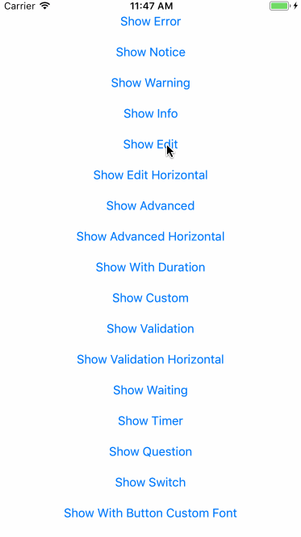

# ⭐️~Star~⭐️

### UI工具集合俱乐部   不断更新～～～

||||
|:---:|:---:|:---:|
|[TableView](https://github.com/CooFree/CFCustomTableView) 滑动删除、头部放大、图片预览|[代码库](https://github.com/CooFree/BaseCode) 收集一些闲散代码|[Button](https://github.com/CooFree/CFButton) 收集Button自定义|
||||
|[Refresh](https://github.com/CooFree/CFRefresh) qq、京东、写字、刷新集合|||

### 哎哟～不错哦～
||||
|:---:|:---:|:---:|
|[动画MMParallaxCell](https://github.com/adad184/MMParallaxCell)|[拖动CollectionView](https://raw.githubusercontent.com/ra1028/RACollectionViewReorderableTripletLayout)|[今日头条频道拖拽重排效果实现。](https://github.com/asiosldh/BMDragCellCollectionView)|
||||
|[漂亮的AlertView](https://github.com/dogo/SCLAlertView)|[有趣的LLSwitch](https://github.com/lilei644/LLSwitch)|[滑杆效果CRNumberFadedAnimation](https://github.com/CRAnimation/CRNumberFadedAnimation)|
||||
|[KSGallerySlidingCollectionView](https://github.com/btxkenshin/KSGallerySlidingCollectionView)|[NavigationBarTransition](https://github.com/MoZhouqi/KMNavigationBarTransition)|[透明的ViewController](https://github.com/onevcat/VVBlurPresentation)|
||||
|[BRPickerView](https://github.com/91renb/BRPickerView)|||
