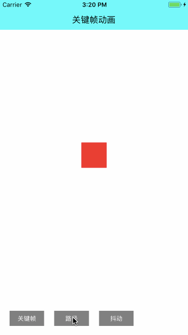

# CFKit

### UI工具集合俱乐部   不断更新～～～

||||
|:---:|:---:|:---:|
|[TableView](https://github.com/CooFree/CFCustomTableView) 滑动删除、头部放大、图片预览|[代码库](https://github.com/CooFree/BaseCode) 收集一些闲散代码||
||||

### 收集的一些供学习的资料
||||
|:---:|:---:|:---:|
|[IOSAnimationDemo](https://github.com/yixiangboy/IOSAnimationDemo) 动画基础学习|||
