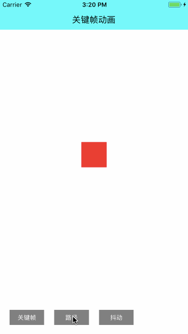

# ⭐️给我呀嘛一颗星，亮呀嘛亮晶晶⭐️

### UI工具集合俱乐部   不断更新～～～

||||
|:---:|:---:|:---:|
|[TableView](https://github.com/CooFree/CFCustomTableView) 滑动删除、头部放大、图片预览|[代码库](https://github.com/CooFree/BaseCode) 收集一些闲散代码|[Button](https://github.com/CooFree/CFButton) 收集Button自定义|
||||
|[Refresh](https://github.com/CooFree/CFRefresh) qq、京东、写字、刷新集合|||

### 收集的一些供学习的资料
||||
|:---:|:---:|:---:|
|[SwipeTableView](https://github.com/Roylee-ML/SwipeTableView) 一个很强大的框架|[拖动CollectionView](https://raw.githubusercontent.com/ra1028/RACollectionViewReorderableTripletLayout)|[今日头条频道拖拽重排效果实现。](https://github.com/asiosldh/BMDragCellCollectionView)|
||||
|[漂亮的AlertView](https://github.com/dogo/SCLAlertView)|[IOSAnimationDemo](https://github.com/yixiangboy/IOSAnimationDemo) 动画基础学习|[MXSegmentedPager](https://github.com/maxep/MXSegmentedPager) 结构很好的一个框架|
